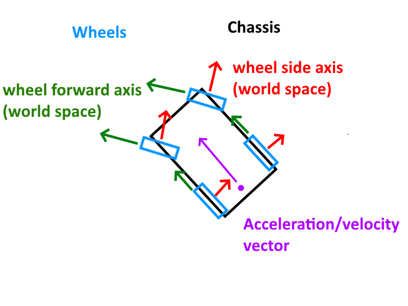

# Swerve Drive Kinematics Guide

## Required Reading

Before diving into implementation, familiarize yourself with these WPILib documentation pages:

- [Introduction to Kinematics and Chassis Speeds](https://docs.wpilib.org/en/stable/docs/software/kinematics-and-odometry/intro-and-chassis-speeds.html)
- [Swerve Drive Kinematics](https://docs.wpilib.org/en/stable/docs/software/kinematics-and-odometry/swerve-drive-kinematics.html)

---

## Understanding Kinematics

### What is Kinematics?

Kinematics is the process of converting chassis speeds into individual wheel speeds. if you want to more about the math behined it read the FRC docs

### Chassis Speeds

Chassis speeds represent the velocity of the robot chassis itself, consisting of three components:

- **X velocity** - Forward/backward movement
- **Y velocity** - Left/right strafing movement  
- **Omega (ω)** - Rotational velocity

In the diagram above, the purple vector represents the chassis velocity direction.

### Wheel Speeds

Individual wheel speeds are calculated from the chassis speed using kinematics. In the diagram above, the green vectors protruding from each wheel represent these individual wheel velocities.

---

## Implementation

### Setting Up Swerve Drive Kinematics

In your `RobotConstants` class:

1. Create a new `SwerveDriveKinematics` object
2. The constructor requires four `Translation2d` objects representing each wheel's position in inches relative to the robot's center
3. **Important:** Input the wheels in reading order (top-left → top-right → bottom-left → bottom-right)

### Creating Chassis Speed

Now that you have kinematics configured:

1. Declare and construct a variable of type `ChassisSpeeds`
2. Assign the value using `ChassisSpeeds.fromFieldRelativeSpeeds()`
   - Parameters: X velocity (double, m/s), Y velocity (double, m/s), Omega velocity (double, rad/s), and your `sim_gyro` object

### Calculating Module States

1. Create a variable of type `SwerveModuleState[]` (array/list)
2. Use your kinematics constant and chassis speeds to calculate and assign the module states for each wheel

---

## Swerve Module Class

### Creating the Module Class

Within `Swerve.java`, create a `SwerveModule` class with the following methods:

**Public Methods:**
- `setState()` - Sets the desired state for the module
- `getState()` - Returns the current state of the module

### Integration with Main Swerve Class

Back in `Swerve.java`:

1. Construct four `SwerveModule` objects (consider organizing these in a separate inner class for logical separation)
2. In your `fieldRelativeDrive()` method:
   - Use `setState()` to pass the module state to each swerve module
   - Make sure to use the correct index from `moduleStates` (don't accidentally assign the front-left module with back-right values!)

### Implementing State Management

**In Swerve.java:**
1. Create a variable called `realModuleStates` of type `SwerveModuleState[]` with size 4
2. Use `getState()` to retrieve and assign the current module values from each `SwerveModule` to the correct index positions

**In SwerveModule.java:**
1. In `setState()`: Extract the velocity and angle setpoints from the passed state
   - Ensure velocity is in meters per second
   - Ensure angle is in radians
2. In `getState()`: Simply return the current values
   - Yes, for now they will be identical to what was set - this is expected!
