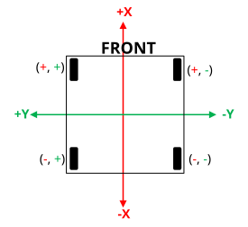

# Input to Drive

## Goals
1. Get input from a controller and update simulated values periodically.
2. Change controller input direction based on alliance color.

---

### Suggested Readings
1. [Coordinate System](https://docs.wpilib.org/en/stable/docs/software/basic-programming/coordinate-system.html)
2. [Get Alliance Color](https://docs.wpilib.org/en/stable/docs/software/basic-programming/alliancecolor.html)

---

### Input to Drive

The first step in creating a swerve drive is being able to pass in inputs from a controller and produce output. In this case, the output is **movement**.

The basic idea of the input–output structure is:
`RobotContainer --> Swerve --> SwerveModule --> Swerve`

For now, we will just be working in **RobotContainer** and **Swerve**.

---

#### Step 1: Create a Controller
- Create an Xbox controller.
- Pass the following values through a default command into a command inside `Swerve`:
  - **Left Y value** (forward/backward)
  - **Left X value** (strafe left/right)
  - **Right X value** (rotation)

Name the command something like `DriveCommand`.

---

#### Step 2: Simulated Movement
To simulate movement in the robot:

1. Create a `Pose2d` variable and name it something like `estimatedPose`.
2. Create a method that takes the **X** and **Y** components and multiplies them by the update frequency.
   - Make sure the clock speed is stored as a **constant**.
3. Add the calculated values to the relative X or Y components of `estimatedPose`.
   - This ensures movement continues smoothly, rather than resetting every cycle.

---

#### Step 3: Handle Rotation
For rotation:
- Invert the **omega** value (right stick X).
- Multiply by the frequency.
- Add the result to the rotation component of `estimatedPose`.

---

If you’ve done everything correctly, you should now be able to **simulate the robot and move it around**!!!

---

### Switching Alliance

To break your bot (and make your driver really angry), disconnect your robot simulation. Go to the **FMS box**, click **Red 1**, and change it to anything that is **Blue**.

Now try running the robot again. You’ll notice: **nothing is different**—and that’s the problem.

We want to **invert the X and Y components of our `estimatedPose`** based on the alliance color.
- If **Blue** --> invert X and Y
- If **Red** --> leave them as normal

---

#### Step 1: Track Alliance Color
In `RobotContainer`:
1. Create a new method that assigns a boolean value to a variable, e.g. `isBlue`.
2. Pass that boolean into your `Swerve` class.

---

#### Step 2: Use the Alliance Flag
Inside `Swerve`:
1. Create a method that accepts the boolean value from `RobotContainer`.
2. Store it as a local variable.

---

#### Step 3: Conditional Inversion
When updating the pose:
- Multiply the X and Y components of `estimatedPose` by `-1` if `isBlue` is true.
- A ternary operator makes this easy:

---

If you’ve done everything correctly, the robot should be able to **drive on both allainces properly**!
